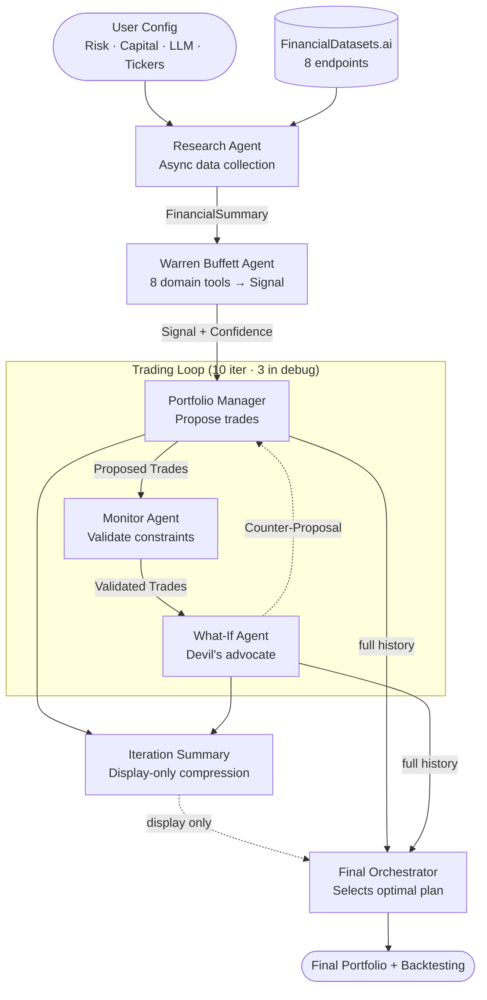

<div align="center">

# AI-Agent-Driven Hedge Fund


<br><br>


</div>

---

> **Educational Project**
> This project demonstrates how autonomous AI agents can communicate, exchange information, and collaborate to make financial decisions. It is not intended for real trading.

---

An autonomous Multi-Agent System (MAS) that simulates a hedge fund end-to-end. Agents handle data collection, value analysis, trade proposal, compliance validation, and final decision — all orchestrated sequentially via **LangChain** with either **Google Gemini** or **Anthropic Claude**.

---

## Demo


---

## System Architecture

The pipeline is strictly sequential. Each stage produces a typed output that becomes the next stage's input.



> The iteration summary (compressed debate history) is shown to the user as a readable panel but **not** fed to the Final Orchestrator — which always receives the full raw history for highest-quality decisions.

---

## Agent Pipeline

### 1 — Research Agent
Runs **asynchronously** per ticker. Calls all 8 FinancialDatasets.ai endpoints and structures the results into a `FinancialSummary` Pydantic object with ~60 typed fields including 8-year historical arrays, news headlines, segment revenues, insider trade activity, and analyst consensus estimates.

### 2 — Warren Buffett Agent
Runs **8 domain analysis tools** sequentially against the `FinancialSummary`, then issues a `WarrenBuffettSignal`:

| Tool | What it measures |
|------|-----------------|
| `check_fundamentals` | ROE, ROIC, debt levels, operating margin, liquidity (max score 9) |
| `check_consistency` | Multi-year earnings CAGR + monotonic growth (max score 4) |
| `check_moat` | Historical ROE consistency, margin stability, ROIC (max score 4) |
| `check_management` | Multi-year buyback track record, dividend history (max score 2) |
| `check_book_value_growth` | Book value per share CAGR + period-by-period consistency (max score 5) |
| `check_intrinsic_value` | 3-stage DCF with owner earnings; yields margin of safety vs current price |
| `check_pricing_power` | Gross margin trend + absolute level (max score 5) |
| `check_qualitative_factors` | News headlines, insider buy/sell activity, analyst EPS & revenue consensus |

The final signal is **bullish / neutral / bearish** with a **confidence score 0–100** that directly drives position sizing downstream.

### 3 — Trading Loop (10 iterations, 3 in debug)

Each iteration runs three agents in sequence:

- **Portfolio Manager** — proposes trades respecting risk profile (1–10) and available capital. Position sizing formula: `(confidence/100) × (risk_profile/10) × total_capital`, with a 30% per-ticker cap.
- **Monitor Agent** — acts as a compliance officer. Validates no-shorting, budget constraints, and schema correctness. If invalid, returns violations for the Portfolio Manager to fix next iteration.
- **What-If Agent** — devil's advocate. Identifies the single biggest risk or inefficiency and proposes a concrete executable counter-scenario. Skipped on the final iteration.

### 4 — Final Orchestrator
Receives the full iteration history (all PM proposals, monitor checks, what-if critiques) plus the Warren Buffett signals, and selects or synthesises the single best trade plan. Cross-references signals: BEARISH → no buy. BULLISH + high confidence → reward with allocation.

---

## Backtesting

When a `backtesting_date` is provided, the system runs a **single-point comparison** between the agent portfolio's actual return and three canonical financial benchmarks over the holding period (`backtesting_date` → today).

### Benchmarks

| Benchmark | How it's computed | Why it matters |
|-----------|-------------------|----------------|
| **Risk-Free Rate** | 4.5% annual T-bill proxy, scaled linearly: `0.045 × (days / 365)` | The floor — any strategy should beat cash |
| **1/N Equal-Weight** | `initial_capital / N` allocated equally across all researched tickers, shares bought at `backtesting_date` prices, held passively | DeMiguel et al. (2009) showed naive equal-weighting is surprisingly hard to beat out-of-sample |
| **S&P 500 (SPY)** | SPY close at `backtesting_date` vs SPY close today (2 API calls) | Standard benchmark used by institutional managers |

### Calculation detail

```
agent_start  = Σ(shares × price_at_start) + remaining_cash
agent_end    = Σ(shares × price_today)    + remaining_cash
agent_return = (agent_end − agent_start) / agent_start

alpha = agent_return − benchmark_return   (positive = outperformed)
```

`price_at_start` is the price already fetched by the Research Agent at `backtesting_date` — no extra API cost. `price_today` requires one fresh call per held ticker plus 2 calls for SPY.

> **Limitation:** This is a single-point evaluation, not a walk-forward backtest. A proper walk-forward test (running the agent daily for 3+ months) would require ~450 LLM calls, roughly 17 hours of sequential execution, and $400–500 in API costs — beyond the scope of this educational demo.

---

## Data Sources

All 8 tools use the same `FINDAT_API_KEY`. No additional credentials are needed.

| Tool | Endpoint | Data |
|------|----------|------|
| `get_financials` | `/financials` | Income statement, balance sheet, cash flow |
| `get_metrics` | `/financial-metrics` | 50+ ratios (P/E, ROE, margins, ROIC, etc.) |
| `get_financial_line_items` | `/financials/search` | Granular line items, 8-year history |
| `get_stock_prices` | `/prices` | OHLCV price history |
| `get_company_news` | `/news` | Recent news headlines & sources |
| `get_segmented_revenues` | `/financials/segmented-revenues` | Revenue by product / geography |
| `get_insider_trades` | `/insider-trades` | Form 4 executive buy/sell filings |
| `get_analyst_estimates` | `/analyst-estimates` | Consensus revenue & EPS forecasts |

---

## Tech Stack

| Layer | Technology |
|-------|-----------|
| Agent framework | LangChain (Python) — tool binding, structured output, async loops |
| LLM | Google Gemini (`gemini-3.1-pro-preview`) via `langchain-google-genai` **or** Anthropic Claude (`claude-opus-4-6`) via `langchain-anthropic` |
| Data models | Pydantic — `FinancialSummary`, `WarrenBuffettSignal`, `ResearchAgentOutput` |
| Financial data | [FinancialDatasets.ai](https://docs.financialdatasets.ai) — single API key, 8 endpoints |
| Terminal UI | [Rich](https://github.com/Textualize/rich) — tables, panels, progress bars, Markdown |

---

## Installation

**1. Clone**
```bash
git clone https://github.com/fede-giorgi/ai-agent.git
cd ai-agent
```

**2. Create virtual environment**
```bash
python -m venv venv
source venv/bin/activate   # Windows: venv\Scripts\activate
```

**3. Install dependencies**
```bash
pip install -r requirements.txt
```

**4. Configure environment variables**
```bash
mv env.example .env
```

Edit `.env`:
```env
FINDAT_API_KEY=your_financialdatasets_key      # required — covers all 8 data tools

GOOGLE_API_KEY=your_gemini_key                 # required if using Google Gemini
GEMINI_API_KEY=your_gemini_key                 # (same key, both vars needed by langchain)

# Optional — override LLM (defaults shown)
LLM_PROVIDER=google                            # "google" or "anthropic"
LLM_MODEL=gemini-3.1-pro-preview

ANTHROPIC_API_KEY=your_anthropic_key           # required only if LLM_PROVIDER=anthropic
```

**5. Run**
```bash
python main.py
```

---

## Usage

```bash
python main.py
```

The session prompts you for:

| Prompt | Options |
|--------|---------|
| **Capital** | Any amount 1 – 1,000,000 |
| **LLM** | Google Gemini or Anthropic Claude; choose model |
| **Risk Profile** | 1 (Ultra Conservative) → 10 (Highly Speculative) |
| **Backtesting date** | Optional `YYYY-MM-DD`; enables benchmark comparison |
| **Ticker selection** | `default` (AAPL, MSFT, NVDA, GOOGL, META) · `auto` (5 diversified from ~600-stock universe) · `custom` (up to 5 manual tickers) |
| **Portfolio** | Enter existing holdings or press `no` to start with cash only |

Agents then run sequentially and print their outputs live to the terminal.

---

## Debug Mode

`--debug` skips all prompts and uses hardcoded defaults for fast iteration:

```bash
python main.py --debug
```

| Setting | Debug value |
|---------|------------|
| Capital | $100,000 |
| Risk Profile | 5 (Balanced) |
| Tickers | AAPL, MSFT, NVDA, GOOGL, META |
| Iterations | **3** (vs 10 in interactive) |
| Backtesting | Enabled — today minus 90 days |
| LLM | Reads `$LLM_PROVIDER` / `$LLM_MODEL` env vars, defaults to `google` / `gemini-3.1-pro-preview` |

To test Anthropic in debug mode:
```bash
LLM_PROVIDER=anthropic LLM_MODEL=claude-opus-4-6 python main.py --debug
```

---

## Screenshots


---

## Recording a Demo GIF

```bash
# Install
brew install asciinema agg   # macOS
# Linux: pip install asciinema && cargo install agg

# Record (idle pauses > 2 s are collapsed — LLM wait time won't bloat the cast)
asciinema rec --idle-time-limit 2 demo.cast
python main.py --debug
# Press Ctrl+D when done

# Convert to GIF (3× speed, ~30-60 s from a ~700 s debug run)
agg --speed 3 --idle-time-limit 1 demo.cast demo.gif
```

Place `demo.gif` in the repository root for it to appear at the top of this README.

---

## Contributors

| Name | Role |
|------|------|
| **Luca Barattini** | System architecture, agent pipeline, backtesting, LLM integration |
| **Federico Giorgi** | Co-developer, repository setup |
| **Blanca Caballero** | Contributor |
| **Myriam Pardo** | Contributor |

---

## License

This project is licensed under the MIT License. See the `LICENSE` file for details.
