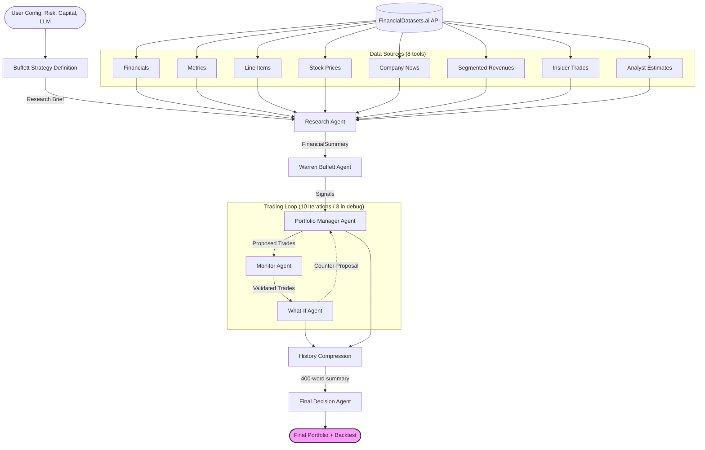

<div align="center">

# 🤖 AI-Agent-Driven Hedge Fund


<br>
<br>


</div>

---

> **🎓 Educational Project Disclaimer**
> This project is designed to demonstrate how autonomous AI agents can communicate, exchange information, and interact collaboratively.
>
> **Note on future-work and improvement areas:** The trading simulation loop is capped at **10 iterations** (interactive) or **3 iterations** (debug mode). In a production environment this could be replaced by convergence thresholds or gradient-descent-style stopping criteria.

---
> **🧱 What is this project about?**

An autonomous Multi-Agent System (MAS) designed to end-to-end automate an hedge fund. Unlike static algorithmic trading scripts, this system utilizes **LangChain** with **Google Gemini** or **Anthropic Claude** to perform fundamental analysis and optimize the portfolio based on the famous Warren Buffett investment strategy.

---

## 🏗️ System Architecture

This system operates on a sequential, loop-based architecture. Information flows from data aggregation to analysis, decision-making, and compliance validation.



## 🚀 Key Features

- **Multi-Agent Orchestration** — Specialized agents for Research, Analysis, Management, and Compliance working in concert.
- **Value Investing Logic** — Implements a "Warren Buffett" persona that evaluates Economic Moats, Intrinsic Value (3-stage DCF with owner earnings), and Management Quality using multi-period historical data.
- **8 Financial Data Sources** — All powered by a single `FINDAT_API_KEY` via FinancialDatasets.ai: financial statements, metrics, line items, stock prices, **company news**, **segmented revenues**, **insider trades**, and **analyst estimates**.
- **Rich FinancialSummary** — 70+ fields including 8-year historical arrays, news, segment breakdown, insider sentiment (net buying $), and forward analyst consensus.
- **Risk Management** — Dynamic capital allocation based on 10 distinct risk profiles (from Ultra Conservative to Highly Speculative).
- **Guardrails** — A Monitor Agent acts as a compliance officer, ensuring no logical errors (e.g. negative cash) occur during the simulation.
- **Trading Simulator** — A "What-If" agent simulates the execution of trades to project portfolio state over multiple iterations.
- **Smart Ticker Selection** — Auto-mode picks 5 diversified tickers from a ~600-stock universe using bucket sampling; custom mode accepts up to 5 manual tickers.
- **Linear Regression Backtesting** — Compares actual portfolio return against a price-trend baseline, reporting alpha (outperformance).
- **Multi-LLM Support** — Choose between Google Gemini (`gemini-3.1-pro-preview`) and Anthropic Claude (`claude-opus-4-6`) at startup or via env vars.
- **History Compression** — The 10-iteration debate history is summarised by an LLM before being passed to the Final Orchestrator, reducing token usage ~70%.

## 🛠️ Tech Stack
- **LangChain** (Python) — agent loop, tool binding, structured output
- **LLM** — Google Gemini (`gemini-3.1-pro-preview`) via `langchain-google-genai`, or Anthropic Claude (`claude-opus-4-6`) via `langchain-anthropic`
- **Data** — [FinancialDatasets.ai](https://docs.financialdatasets.ai) — 8 endpoints, single API key
- **Pydantic** — typed `FinancialSummary` with 70+ fields
- **Backtesting** — `scikit-learn` LinearRegression + `numpy`

## 📊 Data Sources (all via FinancialDatasets.ai)

| Tool | Endpoint | Data |
|------|----------|------|
| `get_financials` | `/financials` | Income statement, balance sheet, cash flow |
| `get_metrics` | `/financial-metrics` | 50+ ratios (P/E, ROE, margins, etc.) |
| `get_financial_line_items` | `/financials/search` | Granular line items, 8-year history |
| `get_stock_prices` | `/prices` | OHLCV price history |
| `get_company_news` | `/news` | Recent news headlines & sources |
| `get_segmented_revenues` | `/financials/segmented-revenues` | Revenue by product / geography |
| `get_insider_trades` | `/insider-trades` | Form 4 executive buy/sell filings |
| `get_analyst_estimates` | `/analyst-estimates` | Consensus revenue & EPS forecasts |

All 8 tools use the same `FINDAT_API_KEY` — no additional credentials required.

## 🦥 Installation
1. Clone the Repository
     ```bash
   git clone https://github.com/fede-giorgi/ai-agent.git
    cd ai-agent
   ```
2. Create a Virtual Environment (Recommended)
   ```python
   -m venv venv
   source venv/bin/activate  # On Windows use `venv\Scripts\activate`
    ```
3. Install Dependencies
   ``` bash
   pip3 install -r requirements.txt
   ```
4. Configure Environment Variables. Rename the example environment file and edit it:
   ```bash
   mv env.example .env
   ```
   Open `.env` and add your keys:
   ```
   GOOGLE_API_KEY=your_gemini_api_key_here
   GEMINI_API_KEY=your_gemini_api_key_here
   FINDAT_API_KEY=your_financial_datasets_key_here   # required — covers all 8 data tools

   # Optional: override the default LLM (defaults shown)
   LLM_PROVIDER=google                               # "google" or "anthropic"
   LLM_MODEL=gemini-3.1-pro-preview                  # any valid model name
   ANTHROPIC_API_KEY=your_anthropic_key_here         # required only if LLM_PROVIDER=anthropic
   ```
   > **No Brave API key or MCP server needed.** News and all data are fetched directly from FinancialDatasets.ai via the `FINDAT_API_KEY`. The `mcp-use` library is **not used** in this project — `tools/mcp.py` exists only as a no-op placeholder.
5. Run the Agent
   ```bash
   python main.py
   ```
6. **Optional:** Run in debug mode to skip manual input entry and use default parameters for testing:
   ```bash
   python main.py --debug
   ```

## 💻 Usage 
Run the main orchestrator script to start the interactive session:
    ```bash
      python main.py
    ```
Interaction required by the user:
- **Capital** — Enter your available capital (e.g., `100000`).
- **LLM** — Select provider (Google Gemini or Anthropic Claude) and model.
- **Risk Profile** — Select a level from 1 (Ultra Conservative) to 10 (Highly Speculative).
- **Backtesting Date** — Optional historical date; enables the linear regression benchmark.
- **Ticker Selection** — `auto` (5 diversified tickers from ~600-stock universe) or `custom` (up to 5 manual tickers).
- **Portfolio** — Input existing holdings (optional) or start fresh.
- **Execution** — Watch the agents collaborate real-time on the console.
- **Result** — Final portfolio allocation, compressed debate summary, and optional backtesting report.

## 📸 Screenshots & Demo

### Demo Run
 


## 🐞 Debug Mode

To facilitate rapid development and testing, `--debug` skips all interactive prompts.

Default debug values:
- Capital: $100,000
- Risk Profile: 5 (Balanced)
- Tickers: AAPL, MSFT, NVDA, GOOGL, META
- Iterations: **3** (vs. 10 in interactive mode — faster turnaround for testing)
- Backtesting: Enabled (today − 90 days)
- LLM: reads `$LLM_PROVIDER` / `$LLM_MODEL` env vars, defaults to `google` / `gemini-3.1-pro-preview`

To test Anthropic in debug mode:
```bash
LLM_PROVIDER=anthropic LLM_MODEL=claude-opus-4-6 python main.py --debug
```

## 📐 Backtesting Methodology

When backtesting is enabled the system:
1. Uses prices from the backtesting date (fetched by the Research Agent) as the starting point.
2. Fetches today's prices for each held ticker.
3. Fetches 90 days of **monthly** price history before the backtesting date (2 API calls per ticker).
4. Fits a `scikit-learn` LinearRegression on the historical monthly prices.
5. Projects the regression line forward to today to produce a **baseline expected return**.
6. Reports **alpha** = actual return − regression baseline per ticker and for the total portfolio.

## 👥 Contributors
- Luca Barattini
- Federico Giorgi
- Blanca Caballero
- Myriam Pardo

## 📄 License

This project is licensed under the MIT License. See the license file for further details.
