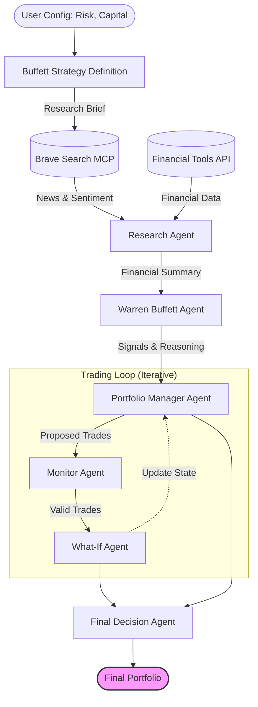

# 🤖 Autonomous AI-Driven Financial Agent Architecture


> **🎓 Educational Project Disclaimer**
> This project is designed to demonstrate how autonomous AI agents can communicate, exchange information, and interact collaboratively.
>
> **Note on future-work and improvement areas:** We're aware that the trading simulation loop (where agents debate strategies) is currently manually capped at 10 iterations by design. However, in a real production environment, this could be improved by using a "gradient descent" logic or convergence thresholds to dynamically determine when the optimal strategy has been reached.

---
> **🧱 What is this project about?**

An autonomous Multi-Agent System (MAS) designed to end-to-end automate an hedge fund. Unlike static algorithmic trading scripts, this system utilizes **LangChain** and **Google Gemini** (LLMs) to perform fundamental analysis and optimize the portfolio based on the famous Warren Buffett investment strategy.

---

## 🏗️ System Architecture

This system operates on a sequential, loop-based architecture. Information flows from data aggregation to analysis, decision-making, and compliance validation.



## 🚀 Key Features

- Multi-Agent Orchestration: Specialized agents for Research, Analysis, Management, and Compliance working in concert.
- Value Investing Logic: Implements a "Warren Buffett" persona that evaluates Economic Moats, Intrinsic Value (DCF), and Management Quality.
- Real-Time Data: Fetches standardized financial statements (Income, Balance Sheet, Cash Flow) and metrics via financialdatasets.ai.
- Risk Management: Dynamic capital allocation based on 10 distinct risk profiles (from Ultra Conservative to Highly Speculative).
- Guardrails: A Monitor Agent acts as a compliance officer, ensuring no logical errors (e.g. negative cash) occur during the simulation.
- Trading Simulator: A "What-If" agent simulates the execution of trades to project portfolio state over multiple iterations.

## 🛠️ Tech StackFramework: 
- LangChain (Python)
- LLM: Google Gemini (gemini-2.5-flash) via langchain-google-genai
- Data Source: Financial Datasets API
- Data Type: Pydantic for structured output

## 🔌 MCP-USE Integration

This project utilizes also [MCP-USE](https://github.com/mcp-use/mcp-use) to facilitate the integration of Model Context Protocol (MCP) servers. This allows the agents to securely and efficiently access external tools, such as the Brave Search MCP, leveraged in this case to fetch the latest news related to the ticker. 

## 🦥 Installation
1. Clone the RepositoryBash
     ```bash
   git clone https://github.com/fede-giorgi/ai-agent.git
    cd ai-agent
   ```
2. Create a Virtual Environment (Recommended)
   ```python
   -m venv venv
   source venv/bin/activate  # On Windows use `venv\Scripts\activate`
    ```
3. Install Dependencies
   ``` bash
   pip install -r requirements.txt
   ```
4. Configure Environment Variables You need API keys for Google Gemini and Financial Datasets. Rename the example environment file and edit it:
   ```bash
   mv env.example .env
   ```
   Open .env and add your keys:
   ```
   GOOGLE_API_KEY=your_gemini_api_key_here
   FINANCIAL_DATASETS_API_KEY=your_financial_datasets_key_here
   BRAVE_API_KEY=your_brave_api_key_here
   ```

## 💻 Usage 
Run the main orchestrator script to start the interactive session:
    ```bash
      python main.py
    ```
Interaction required by the user:
- Capital: Enter your available capital (e.g., 100000).
- Portfolio: Input existing holdings (optional) or start fresh.
- Risk Profile: Select a level from 1 (Ultra Conservative) to 10 (Highly Speculative).
- Ticker Selection: Choose to analyze a specific subset (e.g., AAPL, NVDA) or a list of tickers.
- Execution: Watch the agents collaborate real-time on the console.
- Result: The system outputs a final portfolio allocation table and a detailed report of the decisions.

## 👥 Contributors
- Luca Barattini
- Federico Giorgi
- Blanca Caballero
- Myriam Pardo

## 📄 License

This project is licensed under the MIT License. See the license file for further details.
